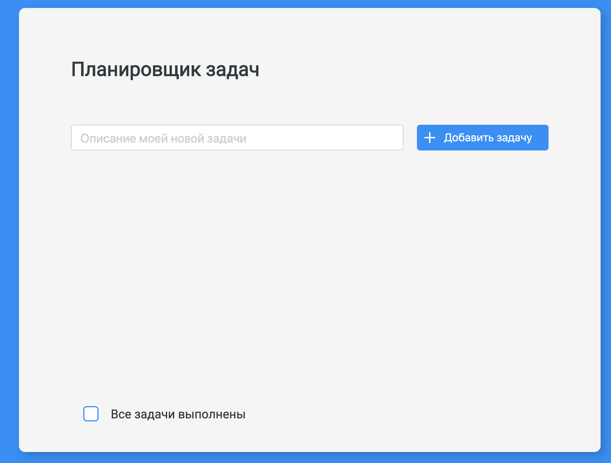

# Напишем планировщик задач на чистом JavaScript

1. Запуск проекта:

```bash
npm start
```

2. После запуска перейдите в браузер и откройте:
   [http://127.0.0.1:8181/](http://127.0.0.1:8181/)

3. Вы должны будете увидеть следующее:

